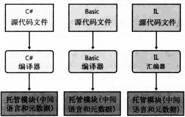
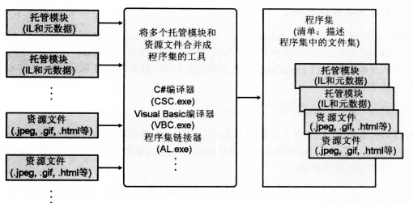
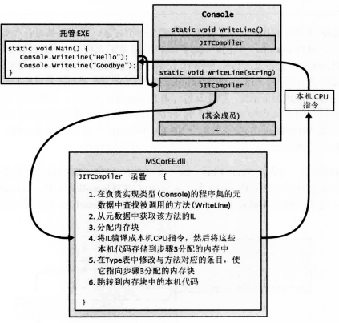
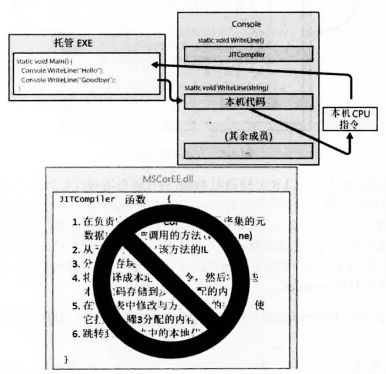
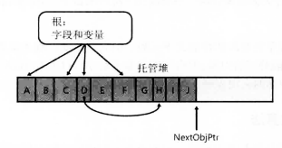
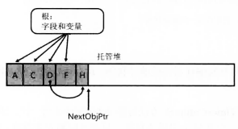
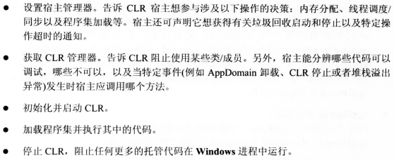
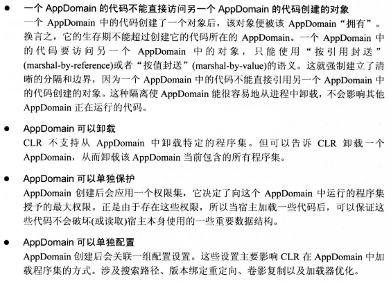

## CLR基础

公共语言运行库(CLR：Common Language Runtime)：是一个可由多种编程语言使用的库。主要作用是保证应用和操作系统之间分离。

因此CLR不关心使用哪一种语言，它相当于一种规范，**只要编译器是面向CLR的即可** 。

### CLR核心功能

- 内存管理
- 程序集加载
- 安全性
- 异常处理
- 线程同步

### 源代码编译成托管模块

#### 源代码编译编译过程

过程如下图所示：

支持CLR的语言通过对应的编译器检查语法和分析源代码编译成托管模块

#### 托管模块

托管模块组成

- PE32或PE32+头
  - PE32能在Windows32位和64位上运行
  - PE32+头只能在Windows64位上运行
- CLR头：包含托管模块得信息
  -  包含CLR版本
  -  标志（flag）
  -  托管模块入口方法（Main）MethodDef元数据token以及模块得元数据，资源，强名称
- 元数据
  - 定义的类型和成员
  - 代码引用的类型和成员
- IL代码（中间语言或托管代码）：编译器生成的代码。在CLR中将其编译成CUP指令。

### 托管模块合并成程序集

CLR和程序集工作。程序级对于CLR来说相当于**组件**。编译器默认将生成的托管模块转换成程序集。具体流程如下图所示。

### 加载公共语言运行库

前提是电脑需要安装.NET Framework。

具体流程：

- Window检查文件头，决定创建32位还是64位进程。
- 加载MSCorEE.dl的对应版本（x86，x64或ARM）
- 进程的主线程调用MSCorEE.dll中定义的一个方法
- 初始化CLR，加载EXE程序集
- 调用入口方法（Main）
- 托管应用程序启动并运行

非托管应用程序加载托管程序集：Window自动加载并初始化CLR并处理程序集中的代码。

### 执行程序集的代码

执行代码的前提条件是将IL转换成CPU指令，因此CLR的JIT编译器将其转换成CPU指令。

IL代码在运行时编译成本机CPU指令，需要分配更多的非共享内存，并要花费额外

JIT(just in time) :即时编译器。

方法的首次调用如下图所示

JITCompiler函数被调用流程：

- 首先知道调用的方法，以及具体是什么类型定义了该方法
- JITCompiler会在程序集的元数据中查找被调用的方法的IL
- JITCompiler验证IL代码，并将IL代码编译成CPU指令
- 本机CPU指令保存到动态分配的内存块中
- JITCompiler回到CLR位类型创建的内部数据结构，找到与被调用方法对应的那条记录，修改最初对JITCompiler的引用，将其指向内存块中的地址
- JITCompiler函数跳转到内存块中的代码，代码执行完毕并返回

方法的二次调用如下图所示

第二次调用同个函数则会直接执行内存块中的代码，完全跳过JITCompiler函数的执行

方法仅在首次调用时有性能损失，以后调用都以本机代码的形式全速运行，无需重新验证IL并将其编译成本机代码。

## 托管堆和垃圾回收

### 从托管堆分配资源

CLR要求所有对象都从托管堆分配。进程初始化时，CLR划出一个地址空间区域作为托管堆。同时维护一个指针，该指针指向下一个对象在堆中分配的位置。最初时该指针指向基地址。

一个区域被非垃圾对象填满后，CLR会分配更多的区域。直到进程地址空间都被填满。

- 32位15.GB
- 64位8TB

### 对象内存的分配

C#的 new 操作符导致CLR执行的一下步骤：

- 计算类型的字段（以及从基类型继承的字段）所需的字节
- 加上对象的开销所需的字节数，每个对象有两个开销字段
  - 类型对象指针
  - 同步块索引
  - 32位每个对象增加8字节，64位每个对象增加16字节
- CLR检查区域中是否有分配对象所需的字节数
  - 托管堆有足够的空间时，就在CLR维护的指针指向的地址处存放对象，为对象分配的字节会被清零
  - CLR维护的指针的值会加上对象占用的字节数来得到新的地址
  - 调用类型的构造器，同时传入指针地址，new操作符返回对象的引用

### 垃圾回收算法

CLR采用的是引用跟踪算法，当CLR没有足够的空间来分配对象时，就会触发垃圾回收。CLR开始GC时，首先暂停进程中的所有线程。这样可以防止线程在CLR检查期间访问对象并更改其状态。

具体实现步骤如下：

- CLR开始后会暂停所有线程。(目的是防止线程在CLR检查期间访问对象并更改其状态)
- CLR进入GC的标记阶段。(CLR遍历堆中的所有对象，将同步块索引字段中的一位设为0，表名该对象应删除)
- CLR检查所有活动根，并查看引用对象。(若根包含null，CLR则忽略)
- 检查完毕后，堆中对象有两种状态
  - 已标记：存在至少一个根引用它，不能被垃圾回收，
  - 未标记：不存在被访问的根， 会被垃圾回收
- GC进入压缩（compact **碎片整理**）阶段，将保留对象，分配在连续的内存空间当中。(解决了堆的空间碎片化问题)
- CLR从每个根减去所引用的对象在内存中偏移的字节数，这样保证了每个根的引用对象为同一个对象。对象只在内存中变化了位置
- CLR维护的指针指向最后一个对象之后的位置

回收前，回收后如下图所示：

需要注意的是进程的内存以耗尽时，分配更多的内存则会抛出异常，WIndow将终止进程并回收进程使用的全部内存。

### 代：提升性能

CLR的GC是基于代的垃圾回收器，主要依据是以下三个条件

- 对象越新，生存期越短
- 对象越老，生存期越长
- 回收堆的一部分，速度快于回收整个堆

CLR包含了三代，分别为三代提供预算容量，具体实现步骤如下

- CLR初始化会为三代提供一个预算容量
- 第0代
  - 初始化的对象会被存入到第0代当中
  - 当第0代的容量超过预算，则会触发一次GC，
    - 此时GC会判断第1代是否超过容量
    - 未超过容量，此时GC只会检查第0代中的对象
  - 若第1代还有余量，随后将保留下来的对象存储到第1代当中
  - 此时第0代的暂时时空的，重复上述步骤直到第1代容量超出预算
- 第1代
  - 当第1代的容量超出预算时
  - GC则会先检查第1代中的对象，然后检查第0代中的对象
  - 将第1代中保留下来的对象提升至第2代中，第0代中的对象保留代第1代中
- 第2代
  - 当第2代的容量超出预算时
  - GC则会先检查第2代中的对象，然后检查第1代中的对象，再检查第0代中的对象
  - 如若还是不够则会抛出内存不足的异常

值得注意的是GC会根据实际情况动态调整整个代的容量情况

### GC触发条件

- 分配内存超出预算时
- 代码显示调用System.GC的静态Collect方法
- Windows报告低内存情况
- CLR正在卸载AppDomain
- CLR正在关闭

## CLR寄宿和AppDomain

### CLR寄宿

.NET Framework在Windows平台运行的前提条件是所有托管模块和程序集文件都必须使用Windows PE文件格式，或者.exe、.dll。

### AppDomain(应用域)

AppDomain是一组程序集的逻辑容器。它存在的意义是为了提供隔离。

CLR初始化时创建第一个AppDomain(应用域)，该应用域仅在进程终止时才会被销毁

AppDomain(应用域)的具体功能

## 计算限制的异步操作

CLR线程池基础

CLR包含了代码管理它的线程池。线程池是你的应用程序使用的线程集合。

