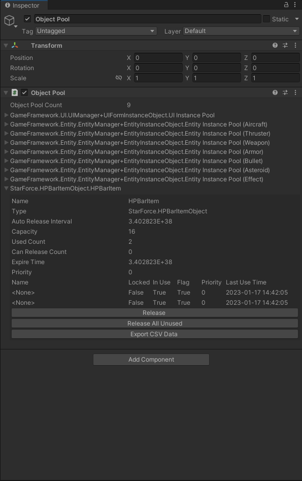

## 作用

主要原理就是对象池。在程序当中主要作用是防止对象被频繁创建和销毁、减少GC、预加载等作用。对象池一般用于存储UnityEngine下的对象（如Unity中的GameObject对象）。

## 目录

- ObjectPool
  - ObjectBase 
  - ObjectPoolBase
  - IObjectPool 
  - IObjectPoolManager
  - ObjectPoolManager
  - ObjectPoolManager.Object
  - ObjectPoolManager.ObjectPool
  - ObjectInfo
  - ReleaseObjectFilterCallback

### 对象部分

#### ObjectBase 对象基类

GF的对象池并没有直接存储目标对象，而是存储的ObjectBase对象，目标对象的存储在该类的m_Target字段，也就是说对于我们需要存储的对象，需要重新实现一个继承ObjectBase的类，这个类作为目标对象的容器，主要作用是避免与GF耦合，另外该类也记录目标对象的信息，如名称，目标对象，锁定状态，优先级，自定义释放检查标记，上次使用时间。通过Initialize初始化对象相关信息，重写OnSpawn、OnUnspawn方法实现对象获取、回收是执行额外逻辑。该类实现了IReference接口，外部获取其子类时应该从引用池获取。

#### ObjectPoolManager.Object

该类为ObjectPoolManager内部对象,其主要作用是直接存储泛型类Object的对象，Object泛型约束为ObjectBase类型，类中有一个类型为泛型T的字段，这个字段会引用对应的ObjectBase对象。对象池不直接访问ObjectBase对象而是访问ObjectPoolManager内部对象Object，Object主要属性是直接返回ObjectBase 对象的属性，Object还会记录目标对象的是否正在使用状态以及获取计数。ObjectBase的OnSpawn和OnUnspawn也是通过Object的Spawn和UnSpawn调用。

该对象的继承了IReference接口，并且该对象的创建是通过调用Create方法，随后从引用池获取对象，并且该对象也实现了IReference，在实现的IReference的过程中也通过引用池释放对象，外部无需管理该对象。

### 对象池部分

#### IObjectPool接口与ObjectPoolBase对象池基类

IObjectPool接口为对象池泛型接口，并且限制了对象池的对象必须是ObjectBase类型。

ObjectPoolBase抽象池基类不是泛型，其主要主要作用ObjectPoolManager同时获取所有对象池的一些通用数据时使用。

二者主要区别在于IObjectPool接口明确知道存储的对象类型。ObjectPoolBase适合处理集合通用逻辑，而IObjectPool适合处理对具体目标对象的操作。

#### ObjectPoolManager.ObjectPool对象池

主要关注以下几个字段：

- m_Objects：该字段类型为GameFramework内封装的数据结构GameFrameworkMultiDictionary<string, Object<T>>，与C#字典类似，不同的在于该结构是一个键（key）对应多个值（value）。键（key）存储的是对象的Name,值（value）存储的是拥有相同Name的对象集合。
- m_ObjectMap：该字段的键（key）存储的是ObjectBase中具体的对象，值（value）存储的是Object。

- m_AllowMultiSpawn：该属性为false的时候不被允许多次使用，为ture的时候，表示允许对象被多次获取，一般情况下不允许这种做法，该字段的主要表现在GameFramework的资源模块中，因为资源对象我们只需要其在内存中存在一份即可（例如Unity的资源）。

主要关注以下几个方法：

- Register：创建对象，首先判断创建的对象是否为空，不为空的时候，利用Object的内部方法创建对应的对象，并将其添加到m_Objects，与m_ObjectMap当中，随后判断当前对象池中对象的数量是否大于对象池容量，大于则释放对象池中的可释放对象。
- Spawn：获取对象，判断对象名称是否为空，为空抛出异常，随后m_Objects存在这个key,则出去对应的Object集合，并检查是否有可以使用的，若存在则返回对应的对象（ObjectBase）。
- Unspawn：回收对象，首先判断回收的对象是否为空，不为空的时候调用内部方法GetObject获取Object对象，如果该对象没有通过Register注册到对象池中，会抛出错误。
- GetAllObjectInfos：该方法返回ObjectInfo结构体数组，包含对象池内所有物体的信息，在GF里面主要展示在Inspector面板上。
- Release：释放对象池中的可释放对象。该接口可以直接调用，也可以间接调用，其主要目的是每过一段时间就可以释放对象，这个时间是由AutoReleaseInterval属性决定，不同的对象池的释放时间间隔不同，Release过程会先获取可释放对象序列，然后通过委托ReleaseObjectFilterCallback对可释放物体序列进行筛选后，最后仅对筛选后的对象调用ReleaseObject进行释放。
- DefaultReleaseObjectFilterCallback是ReleaseObjectFilterCallback委托类型方法，这个方法负责筛选符合要求的对象进行释放。我们如果要特殊要求，则可以在构造函数调用时传入自定义的方法。
- ReleaseObject：释放对象，该方法会从m_Objects，m_ObjectMap中移除对应的对象，等等释放流程。

### 对象池管理器部分

#### ObjectPoolManager对象池管理器

- 对象池管理器用Dictionary<TypeNamePair, ObjectPoolBase>类型存储所有的对象池，TypeNamePair储存对象类型、名称。

- CreateSingleSpawnObjectPool：创建一个对象同时只能被获取一次的对象池。

- CreateMultiSpawnObjectPool：创建一个对象能被同时获取多次的对象池。

  等等一些查询对象池功能，以及一些释放对象功能等等，主要销毁对象池等功能。

## 使用方法

- 首先创建一个管理需要使用对象池的目标对象（即使用的对象池的目标物体）的类，并且该类需要继承ObjectBase，并且在该类当中新增一个创建该对象的接口，通过调用引用池ReferencePool.Acquire创建该对象，并且初始化该对象并将目标对象传入其中。最后实现Release。
- 在管理目标对象池的的类当中创建对象池，传入对象的相关的参数，并用IObjectPool接口引用对象池。
- 通过调用IObjectPool接口的Spawn方法获取管理目标对象的类，若该类不存在则调用IObjectPool的Register注册方法，创建管理目标对象的类。
- 当目标对象需要被回收时候调用IObjectPool的Unspawn方法，来回收对象。

具体可以查看GF的HPBarItemObject、HPBarComponent、HPBarItem。等相关脚本。

## Inspector面板

Inspector面板可以实时查看对象池的实际情况，更加方便检测。

## 总结

相比较引用池，对象池的主要作用是管理具体的游戏物体，适合于管理更加复杂的物体，并且需要用ObjectBase、Object来包装它。所以引用池适合于更加简单的业务，对象池更加适合复杂的业务。