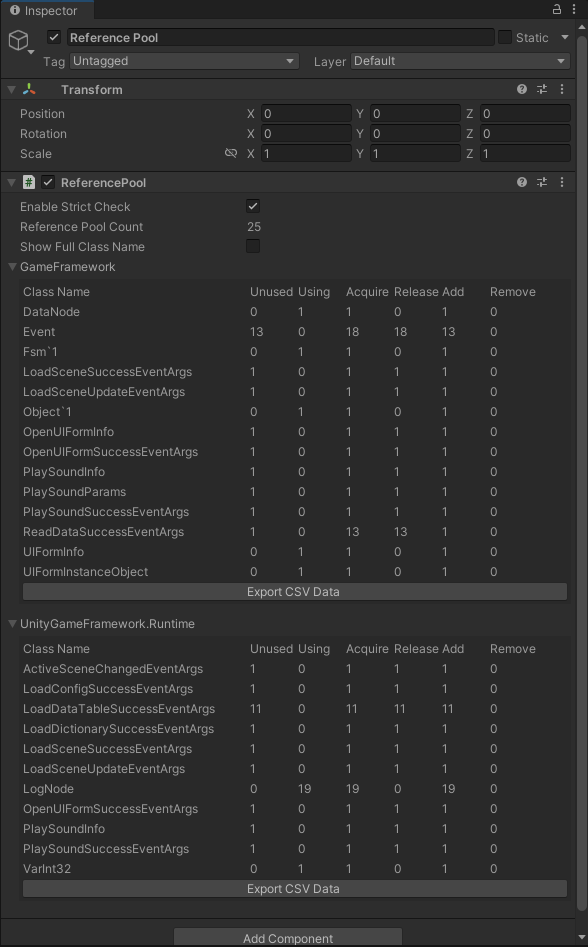

## 作用

主要原理就是对象池。在程序当中主要作用是防止对象被频繁创建和销毁、减少GC、预加载等作用。引用池一般用于存储C#普通类型对象。

## 目录

- ReferencePool
  - IReference
  - ReferencePool
  - ReferencePool.ReferenceCollection
  - ReferencePoolInfo

### 接口

#### IReference接口

该接口只有一个Clear方法，此方法会在对象被引用池回收时调用，每一个需要被引用池存储的类型都需要实现此接口，清空当前状态，恢复到初始状态，供下次使用。

### 类

#### ReferenceCollection池子类

该内为引用池(ReferencePool)内部类，项目中对需要使用引用池的类型，都创建一个引用池，不同类型的对象存储在各自类型的池子中。ReferenceCollection代表一种类型的引用池。

```c#
//存储对象的队列
private readonly Queue<IReference> m_References;
//当前引用池的对象类型
private readonly Type m_ReferenceType;
//正在使用引用数量
private int m_UsingReferenceCount;
//获取引用数量
private int m_AcquireReferenceCount;
//归还引用数量
private int m_ReleaseReferenceCount;
//增加引用数量
private int m_AddReferenceCount;
//移除引用数量
private int m_RemoveReferenceCount;
//当前引用池未使用的道具
public int UnusedReferenceCount;
//从引用池获取引用
public T Acquire<T>() where T : class, IReference, new()
//从引用池获取引用
public IReference Acquire()
//将引用归还引用池
public void Release(IReference reference)
//向引用池中追加指定数量的引用
public void Add<T>(int count) where T : class, IReference, new()
//向引用池中追加指定数量的引用
public void Add(int count)
//从引用池中移除指定数量的引用
public void Remove(int count)
//从引用池中移除所有的引用。
public void RemoveAll()
```

重点关注：

- Acquire：该接口主要作用是从引用池里获取对象，首先判断获取对象的类型是否与该引用池类型是否相同，不同则抛出异常，然后判断引用池队列内是否还存在未使用的对象，存在则返回，不存在则创建一个新的对象然后再返回。

- Release：该接口主要作用是将使用的对象归还给引用池，首先调用IReference的Clear接口将对象重置到初始状态，然后将该对象归还到队列当中。

- Add：给池子队列添加对象。Remove：给池子队列移除对象。RemoveAll ：清空池子队列。这三个接口主要作用是预加载以及手动释放引用池，主要注意释放的时候需要确保一段时间内不会在用到这些对象。

#### ReferencePool类

该类为一个静态类，主要作用是管理所有的引用池，为外部提供访问引用池的接口，

```c#
//存储所有类型的引用池
private static readonly Dictionary<Type, ReferenceCollection> s_ReferenceCollections = new Dictionary<Type, ReferenceCollection>();
//是否开启强制检查
private static bool m_EnableStrictCheck = false;
//获取所有引用池的信息
public static ReferencePoolInfo[] GetAllReferencePoolInfos()
//清除所有引用池
public static void ClearAll()
//从引用池获取引用
public static T Acquire<T>() where T : class, IReference, new()
public static IReference Acquire(Type referenceType)
//将引用归还引用池
public static void Release(IReference reference)
//向引用池中追加指定数量的引用。
public static void Add<T>(int count) where T : class, IReference, new()
public static void Add(Type referenceType, int count)
//从引用池中移除指定数量的引用
public static void Remove<T>(int count) where T : class, IReference
public static void Remove(Type referenceType, int count)
//从引用池中移除所有的引用
public static void RemoveAll<T>() where T : class, IReference
public static void RemoveAll(Type referenceType)
//强制类型检查
private static void InternalCheckReferenceType(Type referenceType)
//获取对应的引用池
private static ReferenceCollection GetReferenceCollection(Type referenceType)
```

重点关注：

- InternalCheckReferenceType : 其主要作用是检查引用类型，类型检查是基于反射的，对性能会造成一定影响。所以建议在测试环境下开启。
- GetReferenceCollection：获取对应的引用池实列，存在则返回，不存在则创建一个新的实例

#### ReferencePoolInfo结构体

该结构体主要作用就是通过ReferencePool中的GetAllReferencePoolInfos方法获取当前所有的引用池信息，主要是检查引用池的相关信息。

## Inspector面板



Inspector面板可以实时查看对象池的实际情况，更加方便检测。

## 总结

使用引用池，那么就需要自行管理内存。所以使用过后的对象一定要释放。

其他注意事项请查看[对象池模式]()

