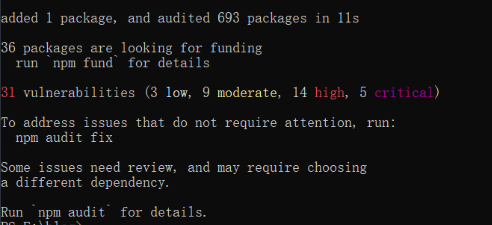

## 简介

Hexo是一个快速、简单且强大的博客框架。你用 [Markdown](http://daringfireball.net/projects/markdown/)（或其他标记语言）写帖子，Hexo会在几秒钟内生成具有漂亮主题的静态文件。

[Hexo官网](https://hexo.io/docs/)

## 环境

### Node.js

Hexo是基于Node.js开发的博客网站。[Node.js官网](https://nodejs.org/zh-cn/)。安装过程不在赘述，网上一大堆教程。

注意点：Node.js的版本可能会导致Hexo不兼容，所以需要查看对应[版本](https://hexo.io/docs/)。

安装完成后通过命令行查看版本号，并检查版本是否正确以及环境变量是否正确，如果下述命令正确输出版本号则代表安装成功。

```
node -v
npm -v
```


### Git

版本管理工具，安装教程不再赘述。

在Hexo中的主要作用是版本管理，以及后绪需要在多台电脑上运行同一个Hexo。

## 安装Hexo

### 安装Hexo

使用CMD安装Hexo，最好不要使用git bash安装，原因是有可能发生一些未知的错误（暂时不知道为啥）输入以下命令：

```
npm install -g hexo-cli
```

安装成功则会输出以下信息，则代表安装成功。


### 验证安装

CMD输入以下命令：

```
hexo -v
```

输入以下相关信息则代表安装成功。


### 创建Hexo项目

通过命令行到达想要创建Hexo的目录下面，输入以下命令即可创建Hexo项目。

```
hexo init
```

此时会从远程克隆一份Hexo项目到本地，则会输出以下信息，则代表初始化成功。


### 运行项目

输入以下命令:

删除本地缓存

```
hexo clean
```

生成静态文件

```
hexo g
```

启动项目

```
hexo s
```

然后用浏览器输入上诉命令输出的地址即可打开网页。

## 部署Hexo到Github

### 创建github仓库


至此仓库创建完成。

### 安装deploy插件

CMD在hexo文件目录下输入以下命令。

```
npm install hexo-deployer-git --save
```

显示以下截图则证明安装成功。



### 推送Hexo

修改配置文件_config.yml 在末尾处配置以下内容。

```
deploy:
  type: git
  repository: (例如：git@github.com:HUI-Space/Hexo-Blogs.git)(仓库的地址可以使用HTTP或者SSH,最好使用SSH，HTTPS可能会用莫名的问题)
  branch: main (默认分支)
```

如下图所示：


随后配置完成后输入以下命令即可推送内容到GitHub。

```
hexo d
```

等待几分钟后，点击下图所示查看自己的博客网址。即可在外网查看自己的博客。


## 多台电脑使用同一个Hexo

### 环境

需要将对应的电脑安装所有的环境，node.js ,git,以及git的凭证，并添加到GitHub上

### 创建分支

在原本的创建的博客仓库新建一个分支，我这里给他命名为hexo 分支，然后将博客仓库的默认分支修改为hexo分支，修改方式如下图所示。


随后查看修改是否成功。


### 克隆hexo分支

- 使用git 克隆hexo的分支到本地，

- 将除了.git的文件夹的所有内容删除，

- 将原本的Hexo源文件除.deploy_git 以外都复制到clone下来的文件夹中

  - 注意复制完成后应该有一个文件名为 .gitignore 如果没有请手动创建内容如下图所示

  

  - 如果已经clone过主题文件，那么需要把theme主题文件夹里的 .git 也删除。因为git不能嵌套上传，最好是显示隐藏文件，检查一下有没有，否则上传的时候会出错，导致你的主题文件无法上传，这样你的配置在别的电脑上就用不了了

- 将clone并修改以后的文件夹推送到远程库，依次输入以下命令

```
git add .
git commit -m "add_branch"
git push origin hexo （注意这里推送到hexo分支）
```

### 开始使用

- 博客内容正常使用 (hexo d) 命令推送。
- 新增的博客内容则需要使用上诉命令进行提交
- 新电脑则需克隆 hexo 分支即可达成多电脑使用同一个hexo环境

## 修改主图

这里以安装butterfly主题为例

[butterfly](https://github.com/jerryc127/hexo-theme-butterfly)

- 在`hexo`项目根目录下下载主题。

  - ```
    git clone -b master https://github.com/jerryc127/hexo-theme-butterfly.git themes/butterfly
    ```

- 安装`pug` 和 `stylus` 渲染器。

  - ```
    npm install hexo-renderer-pug hexo-renderer-stylus --save
    ```

- 把主题文件夹中的 `_config.yml` 重命名为 `_config.butterfly.yml`，复制到 `Hexo` 根目录下与`_config.yml`同级。

- 修改项目根目录下的`_config.yml`文件（称为站点配置文件），开启主题。

相关教程地址：

- [【Hexo】Hexo搭建Butterfly主题并快速美化_hexo butterfly-CSDN博客](https://blog.csdn.net/mjh1667002013/article/details/129290903)
- [Butterfly 安裝文檔(一) 快速開始 | Butterfly](https://butterfly.js.org/posts/21cfbf15/)

## 常用命令

```
hexo n "postName" # 新建文章，文章路径为 source/_posts
hexo new page --path _posts/Unity/Accelerator/Accelerator "Accelerator # 新建文章 source/_posts/Unity/Accelerator/Accelerator 目录：
hexo new draft "draftName"  # 新建草稿，不会发布至你的网站，文章路径为 source/_drafts
hexo new page "pageName"  # 新建页面，文章路径为 source
hexo publish draft "draftName"  # 将草稿进行发布
hexo clean  # 清除缓存，建议每次部署时先执行该命令，再生成静态页面
hexo g  # 生成静态页面至 public 目录
hexo s  # 开启预览访问端口(默认端口 4000，‘ctrl+c’ 关闭 server)
hexo d  # 将文件进行部署
hexo help # 查看帮助
```

## 遇到的问题

### 排版问题

此时推送博客上去博客没有排版，其主要原因是_config.yml中还有一处配置没有修改，如下图所示。


我们需要将url修改为博客网址的网址的前缀，并添加root，为博客的名称，全称为：

```
https://hui-space.github.io/HUI-Blogs/
```

随后再次提交，外网的博客排版就能正常显示。

### 插图

- 修改_config.yml配置文件中的 post_asset_folder 参数为true，其主要目的是使用命令（hexo new “title”）创建新的Markdown文件时候会在同目录下创建出相同的文件夹如下图：


- 修改Markdown的设置，这样我们粘贴图片到Markdown时候图片会自动保存在创建的文件下，则不需要手动添加，如下图：


- 随后使用hexo相关命令提交即可达到插入图片，并在网站上显示图片的效果。