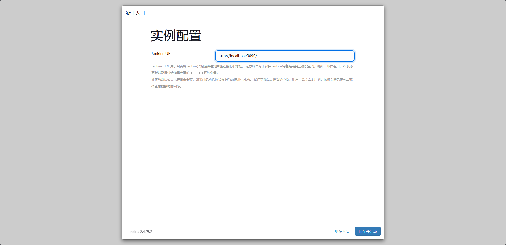

## 简介

Jenkins是一款开源 CI&CD 软件，用于自动化各种任务，包括构建、测试和部署软件。

Jenkins 支持各种运行方式，可通过系统包、Docker 或者通过一个独立的 Java 程序。

[Jenkins 用户手册](https://www.jenkins.io/zh/doc/)

这里仅记录Window相关的操作

## 环境

### Java

安装Jenkins前请先确保电脑已经有java环境，并且确保java环境和Jenkins版本所匹配。这里使用的是Java 21和Jenkins 2.479.2

[Jenkins 下载地址](https://www.jenkins.io/zh/download/)

## Window安装

### jenkins.msi安装

## 创建管理员用户

打开[Jenkins](http://localhost:9090)后台，端口号为上述设置的端口号。

创建管理员用户

此时Jenkins已经安装完成。

## 常用设置

### 运行或关闭Jenkins

Win+R 运行 compmgmt.msc 

 找到下图Jenkins可以修改Jenkins状态。

### 修改工作目录

找到Jenkins安装目录下的jenkins.xml并打开。

修改上图上的路径到想要保存的目录。例如：J:\Jenkins\JenkinsWorkSpace

保存文件，并重启Jenkins即可

### 开启可注册用户

按照下图操作即可

### 

