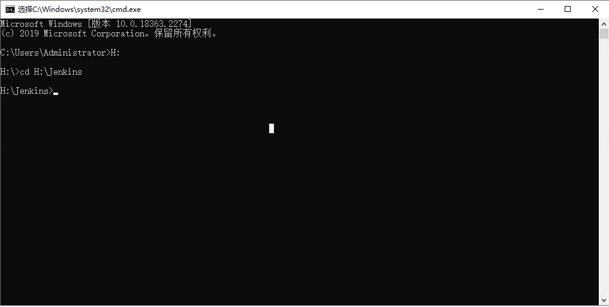

## 简介

从节点的主要作用是在另一台主机在不安装Jenkins环境的情况下，也能执行master主节点相关的任务。

## 环境

### Java

确保Java版本与master主节点环境相同

## 新建从节点


## 配置从节点


主要配置远程工作目录以及标签，标签的主要作用是指定任务执行的节点。

老版本还需要勾选Use WebSocket，次选项位于Launch agent by connecting it to the controller下

## 连接从节点

此时在从节点上打开下图


使用cmd跳转到运行目录



需要注意将localhost修改为master的IP地址

然后执行


此时会下载一个agent.jar文件到工作目录下


然后执行


此时会创建一个remoting文件，并且控制显示Connected,则证明连接成功


## 创建批处理文件快捷连接

```
@echo off
title "Don't Stop Me !"
java -jar agent.jar -url http://192.168.16.194:9090/ -secret 3155439748a95c9798fc135c84b4448b591d0e8ff2c76cfb9c3896e24fe90d26 -name Win101 -webSocket -workDir "H:\Jenkins"
```


双击批处理文件即可快捷连接

## 问题

### Java版本

从节点的Java版本最好和主节点的Java版本相同，防止版本不同运行不了

### 连接不了

- 防火墙未关闭
- Jenkins版本有问题，重新下载其他的版本安装即可

