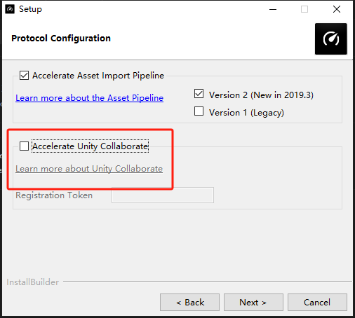
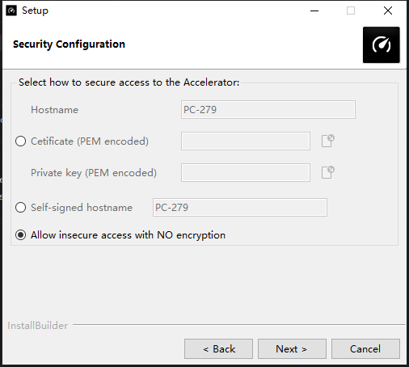
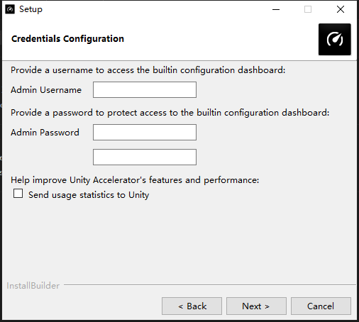
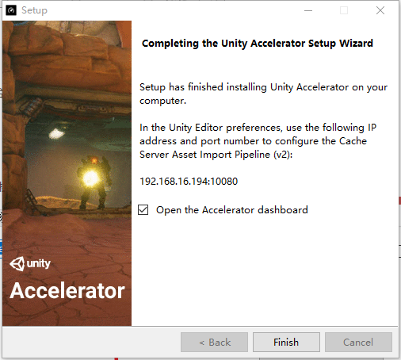
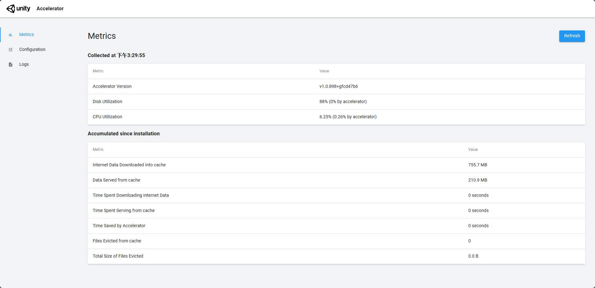
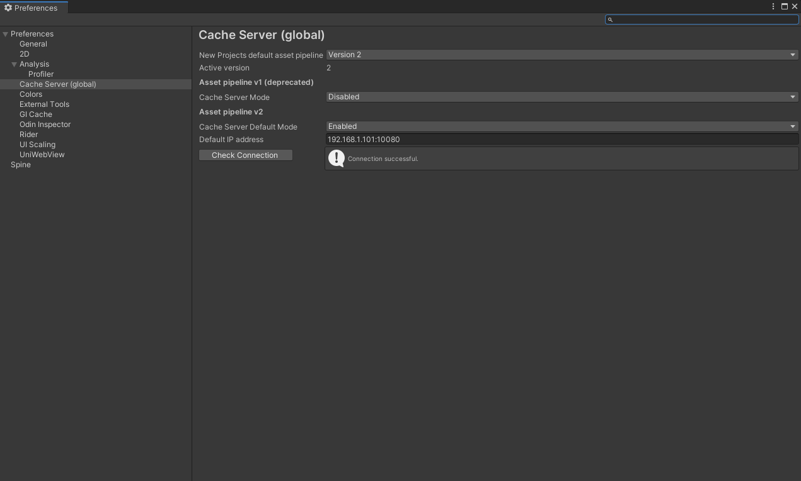
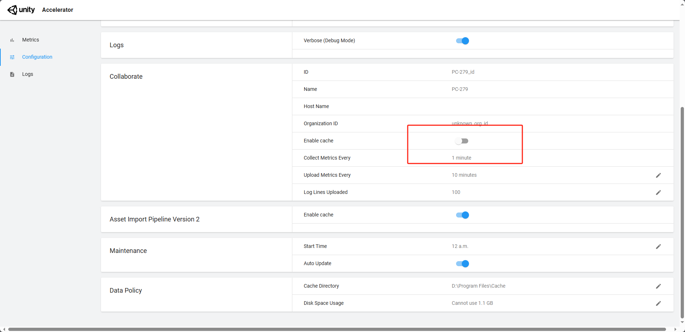

## 简介

减少Unity导入时间（项目组任意人员导入一次后，数据上传中转服务器，其他人导入的时候优先去服务器取一下，有就下载服务器的，没有就自己导入并上传数据）

- [Unity Accelerator - Unity 手册](https://docs.unity3d.com/cn/2021.2/Manual/UnityAccelerator.html#Troubleshooting)

## 部署

下载对应平台的Accelerator，下载地址上述链接当中包含。一般部署在内网当中

### 安装软件

安装的过程中取消上图中的选项，连接权限按需进行配置，一般内网权限的话是不需要进行过多的权限设置

根据需求选择内网通常选择最后即可

设置后的登录账号密码

安装完成后点击完成会拉取后台，后台默认地址为：[Accelerator](http://127.0.0.1/dashboard/#/metrics-page)

Unity 中设置如上图所示。输入IP地址后点击Check Connection 检查是否连接成功。

## 遇到问题

### 链接问题

内网仅仅只能自己连接别人无法连接，此时需要关闭防火墙

### 连接不稳定

需要关闭下图所示

此类问题可能是由于在进行配置的时候，开启了Collaborate的缓存服务，由于Collaborate的优先级会比较高，客户端会频繁的尝试去请求，在尝试请求过程中会导致本地服务器的连接断开

### 加速效果慢

和设备，带宽相关