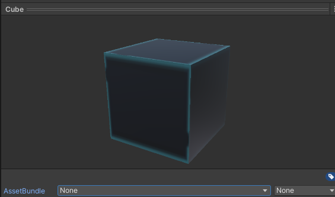

## AssetBundle简介

[AssetBundle](file:///D:/Program%20Files/Unity%20Hub/Editor/2021.3.11f1c2/Editor/Data/Documentation/en/Manual/AssetBundlesIntro.html)文档

## 打包流程简述

## 打包步骤

* __设置打包对象__



AssetBundle是打包的名称，后面None为扩展名称

* __使用代码生成AssetBundle包__

[BuildPipeline.BuildAssetBundles](file:///D:/Program%20Files/Unity%20Hub/Editor/2021.3.11f1c2/Editor/Data/Documentation/en/ScriptReference/BuildPipeline.BuildAssetBundles.html)

```
BuildPipeline.BuildAssetBundles()
参数1：AssetBundle包的打包输出路径
参数2：AssetBundle包的压缩方式（LAMA、LZ4等）
参数3：AssetBundle包的构建平台（Windows、Android、iOS等）
```

* __在编辑器下打包__

调用上面的函数

## 文件解析

* __清单包__

它以它所在的目录命名（AssetBundle的构建位置），会记录所有AssetBundle包名称以及依赖

```
ManifestFileVersion: 0
CRC: 1821201994 						//CRC:校验码，检测文件是否完整
AssetBundleManifest:
  AssetBundleInfos:						//AssetBundle列表信息
    Info_0:
      Name: cube.ab						//名称
      Dependencies: {}					//依赖文件，没有则为{}
    Info_1:
      Name: sphere.ab
      Dependencies:
        Dependency_0: spherematerial.ab
    Info_2:
      Name: spherematerial.ab
      Dependencies: {}

```

* __清单文件__

对于生成的每个包，包括附加的清单包，都会生成一个关联的清单文件，清单文件可以使用任何文本编辑器打开，并包含诸如循环冗余校验 (CRC) 数据和依赖捆绑包的数据。对于普通的 AssetBundle它们的清单文件将如下所示：

```
ManifestFileVersion: 0
CRC: 639253116
Hashes:
  AssetFileHash:
    serializedVersion: 2
    Hash: 33be7a11d115b8a33c92542f06f93884
  TypeTreeHash:
    serializedVersion: 2
    Hash: 602f920c0e02cdbfd52e6272a5676019
HashAppended: 0
ClassTypes:
- Class: 1
  Script: {instanceID: 0}
- Class: 4
  Script: {instanceID: 0}
- Class: 21
  Script: {instanceID: 0}
- Class: 23
  Script: {instanceID: 0}
- Class: 33
  Script: {instanceID: 0}
- Class: 43
  Script: {instanceID: 0}
- Class: 135
  Script: {instanceID: 0}
SerializeReferenceClassIdentifiers: []
Assets:										//Assets:指定AssetBundle包含的资源
- Assets/AssetBundle/Prefabs/Sphere.prefab				
Dependencies:								//依赖文件
- D:/Unity/Assetbundle/./AssetBundles/spherematerial.ab

```

## 加载资源

[AssetBundle.LoadFromFileAsync](https://docs.unity3d.com/ScriptReference/AssetBundle.LoadFromFileAsync.html)	

推荐使用，这是加载AssetBundle最快的方法。如果AssetBundle未压缩或采用了数据块(LZ4)压缩方式，LoadFromFile 将直接从磁盘加载AssetBundle。使用此方法加载完全压缩 (LZMA) 的AssetBundle将首先解压缩AssetBundle，然后再将其加载到内存中

[AssetBundle.LoadFromMemoryAsync](../ScriptReference/AssetBundle.LoadFromMemoryAsync.html)

该方法传入一个包含AssetBundle数据的字节数组。也可以根据需要传递CRC校验码。如果捆绑包采用的是LZMA压缩方式，将在加载时解压缩AssetBundle。LZ4 压缩包则会以压缩状态加载。当下载的是加密数据并需要从未加密的字节创建AssetBundle时会用到。

使用C#的byte数组加载ab包，然后将源数据从byte数组复制到新分配的连续本机内存块中，最终加载的资产将在内存中存在3份：c#的byte数组、ab包在本机内存的副本、资产本身的副本

