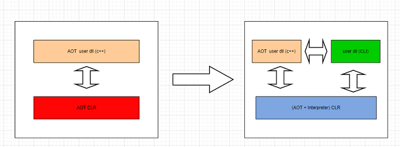

## 简介

HybridCLR是一个**特性完整、零成本、高性能、低内存**的**近乎完美**的Unity全平台原生c#热更方案。

- [HybridCLR github](https://github.com/focus-creative-games/hybridclr)
- [HybridCLR gitee](https://gitee.com/focus-creative-games/hybridclr)
- [官方文档]([HybridCLR (code-philosophy.com)](https://hybridclr.doc.code-philosophy.com/#/))

## 工作原理

[官方文档]([HybridCLR (code-philosophy.com)](https://hybridclr.doc.code-philosophy.com/#/))介绍相当清楚，这里仅记录最最重要的内容。

HybridCLR将unity的il2cpp runtime额外提供了interpreter模块，将它们由纯AOT运行时改造为AOT + Interpreter混合运行方式。

### 具体内容

- 实现了一个高效的元数据(dll)解析库
- 改造了元数据管理模块，实现了元数据的动态注册
- 实现了一个IL指令集到自定义的寄存器指令集的compiler
- 实现了一个高效的寄存器解释器
- 额外提供大量的instinct函数，提升解释器性能

## 安装HybridCLR

因为官网已经介绍的相当清楚了，这里仅仅对重点内容进行记录[安装HybridCLR](https://focus-creative-games.github.io/hybridclr/install/#安装前预备工作)

### 准备工作

- 安装官方推荐的Unity版本，2019.4.40、2020.3.26、2021.3.0或更高版本。
- 为对应的Unity版本添加il2cpp组件。
- 需要安装VS并在安装的过程中必须选中 使用c++的游戏开发 组件。

### 安装

- 使用Unity的Window/Package Manager组件，点击加号 Add package from git url，输入对用版本的HybridCLR的Url进行添加，并等待安装完成

### 初始化HybridCLR

HybridCLR安装完成后，Unity当中会出现HybridCLR的选择栏，如若未出现则未安装成功

- 点击HybridCLR/Installer...会出现HybridCLR Installer编辑器窗口
- 点击安装按钮等待编辑器安装

日志窗口出现安装成功则便是成功，若未输出安装成功，多半是编辑器版本问题，需要根据版本修改相关配置，详细请参考官网设置[修改版本](https://focus-creative-games.github.io/hybridclr/install/#如果你的版本-2-0-5)

## 项目设置

### 配置PlayerSettings

- 打开PlayerSettings，选择需要的打包的平台
- 将Configuration
  - 将ScriptingBackend 切换成 IL2cpp
  - Api Compatability Level 切换为 .Net 4 or .Net Framework
  - 关闭增量式GC(Use Incremental GC) 选项。因为目前不支持增量式GC。

### 热更新模块拆分

项目必须要拆分为AOT和热更新的Assembly，因为包体需要编写相关的代码热更新游戏资源以及代码，所以需要编写基础代码为热更新的部分做铺垫。

常见的拆分方式：

- 将Assembly-CSharp作为AOT程序集。剩余程序集作为热更新程序集
- Assembly-CSharp作为热更新程序集。

无论是那种方式，都需要根据实际情况来进行拆分，最重要的是设置好程序集之间的引用关系，切记设置好引用关系。

### 配置 HybridCLR Settings

重点关注以下几点：

- hotUpdateAssemblyDefinitions
- hotUpdateAssemblies
- preserveHotUpdateAssemblies

以上三个选项主要配置需要热更新的dll，官网已经描述的相当清楚了，自己使用需要根据实际情况使用。

- hotUpdateDllCompileOutputRootDir

编译后的热更新dll的输出路径。会根据平台进行输出。