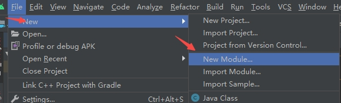
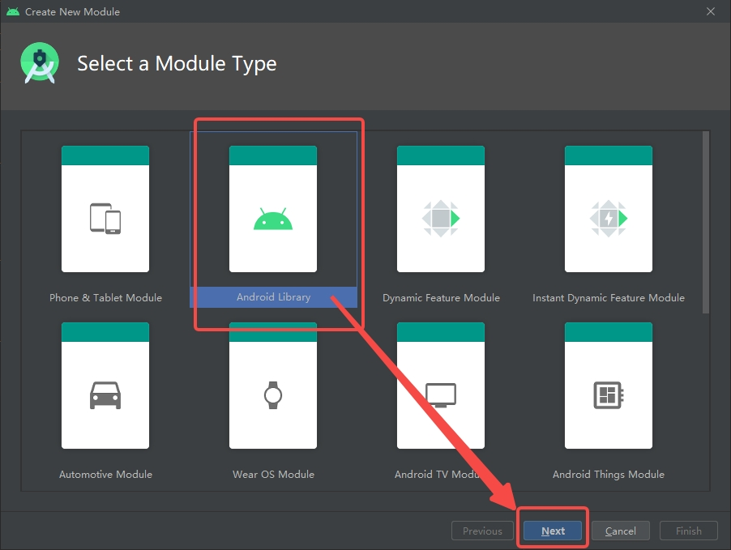
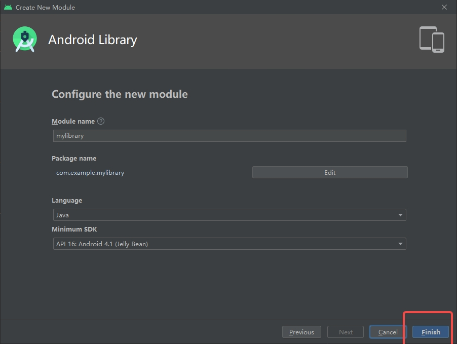
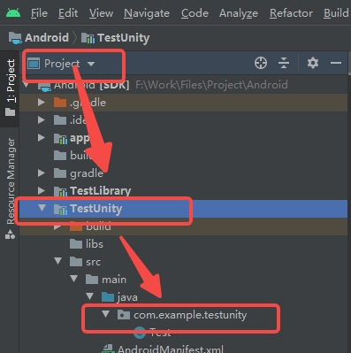

## C#调用Java

### Android Studio

实现步骤：

- 使用Android Studio创建一个新的类库，File > New > New Module > Android Library 创建







- 在对应的类库当中新建脚本（路径：Projec > Library(类库名称) > src > main > java > package(包名)）



- 编写对应的测试脚本

```java
package com.example.testlibrary;

import android.util.Log;
import com.unity3d.player.UnityPlayer;

public class Test
{
    public static String Message = "Message";
    public String Name = "name";

    public static void SetMessage(String message)
    {
        Message = message;
        Log.d(Message, "SetMessage: " + message);

        //第一个参数游戏物体，第二个参数为方法名称，第三个为对应的参数
        UnityPlayer.UnitySendMessage("Test","GetStatic","");
    }
    public static String GetMessage()
    {
        Log.d(Message, "SetMessage: " + Message);
        return Message ;
    }

    public void SetName(String name)
    {
        Name = name;
        Log.d(Name, "SetName: "+name);
        UnityPlayer.UnitySendMessage("Test","Get","");
    }
    public String GetName()
    {
        Log.d(Name, "SetName: "+ Name);
        return Name;
    }
}
```

- 生成类库Build > Make Project 
- 生成过后将生成的jar包放到Unity当中（路径1：Library(类库名称) > build > outputs > arr > (Library)-debug.arr ；路径2：Library(类库名称) > build > arr_main_jar > debug > classes.jar）

注意事项

- 查看创建的类库的build.gradle是否为类库(位置：Android > Gradle Scripts >  build.gradle(创建的类库名称))查看第一行是否为：apply plugin: 'com.android.library' 后缀为 library，defaultConfig主要是包名和SDK的版本，此时创建类库的时候不需要（不清楚作用请自行搜索：build.gradle）修改参数后请保存

```
apply plugin: 'com.android.library'

android {
    compileSdkVersion 33
    buildToolsVersion "30.0.3"

}

dependencies {
    //implementation fileTree(dir: "libs", include: ["*.jar"])
    implementation 'androidx.appcompat:appcompat:1.1.0'
    compileOnly files('libs\\classes.jar')
    testImplementation 'junit:junit:4.12'
    androidTestImplementation 'androidx.test.ext:junit:1.1.1'
    androidTestImplementation 'androidx.test.espresso:espresso-core:3.2.0'

}
```

- 如果需要Android相关的资源必须(Library)-debug.arr，如果只使用类库使用classes.jar即可，建议只使用(Library)-debug.arr

### Unity

实现步骤：

- 将生成的jar包放置到Unity当中，放置路径Assets > Plugins > Android 
- 创建C#脚本与Java交互，可使用这两个接口AndroidJavaObject和AndroidJavaClass

```C#
using System;
using UnityEngine;
using UnityEngine.UI;

public class Test : MonoBehaviour
{
    public Text text;
    public Button btn1;
    public Button btn2;
    public Button btn3;
    public Button btn4;

    /// <summary>
    /// 传入的参数为Java中对应的类库包的路径(com.example.testlibrary)加上对应的类（Test）
    /// AndroidJavaObject javaObject = new AndroidJavaObject("com.example.testlibrary.Test");
    /// AndroidJavaClass javaObject = new AndroidJavaClass("com.example.testlibrary.Test");
    /// </summary>
    private AndroidJavaObject _javaObject;
    private void Start()
    {
        _javaObject = new AndroidJavaObject("com.example.testlibrary.Test");
        btn1.onClick.AddListener(GetStatic);
        btn2.onClick.AddListener(Get);
        btn3.onClick.AddListener(SetMessage);
        btn4.onClick.AddListener(SetName);
    }
    
    private void GetStatic()
    {
        text.text = _javaObject.GetStatic<String>("Message");
    }
    
    private void Get()
    {
        text.text = _javaObject.Get<String>("Name");
    }

    private void SetMessage()
    {
        _javaObject.CallStatic("SetMessage","按钮3");
    }

    private void SetName()
    {
        _javaObject.Call("SetName","按钮4");
    }
}
```

- 查询相关接口即可进行调用

注意事项

- jar包必须放置到Plugins目录下
- 相互调用的接口需要打包后才能生效
- 查阅Unity文档调用静态与非静态的接口

## Java调用C#代码

### Android Studio

实现步骤：

- 找到对应Unity编辑器的jar包。
  - mono路径：Editor > Data > PlaybackEngines > AndroidPlayer> Variations > mono> Release > Classes > classes.jar
  - il2cpp路径：Editor > Data > PlaybackEngines > AndroidPlayer> Variations > il2cpp> Release > Classes > classes.jar
- 导入到Android Studio的libs文件夹下，路径为 Library(类库名称) > libs
- 随后将classes.jar包添加到库当中。右键点击 Add as Library... > OK 等待编译
- 编写代码
  - import com.unity3d.player.UnityPlayer
  - UnityPlayer.UnitySendMessage("","","")该方法为调用Unity的接口//第一个参数游戏物体，第二个参数为方法名称，第三个为对应的参数
- 详细代码可以查看上面的Java 的 Test代码

 注意事项

- 因为Unity打包的时候以及将对应版本的classes.jar包打入项目，所以在需要在Android Studio中的classes.jar包不打入包内，具体做法为修改build.gradle：
  - 打开build.gradle
  - 找到对应的classes.jar包将dependencies 修改为compileOnly
  - 注释掉fileTree
- 如果直接使用Library(类库名称) > build > arr_main_jar > debug > classes.jar 
  - 就不需要做任何处理
  - 如果还引用了其他的第三方库，则库需要将Library(类库名称) > build > intermediates > aar_libs_directory > debug > libs 中的文件添加到Unity中

## Android请求权限

可以在unity请求，Android也可以请求。


