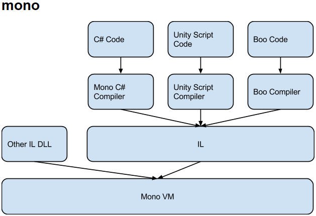
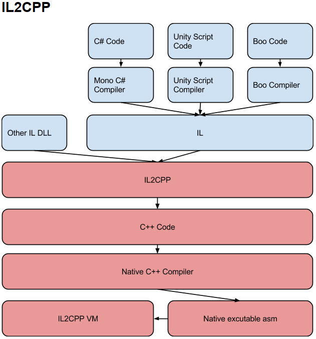

## Mono

Mono如下图所示：

- C#编译器：负责生成公共中间语言（Common Intermediate Language，CIL）
- CLI虚拟机：负责运行生成的CIL，并将IL编译成对应平台的原生码（类似CLR,CLR与CIL即包含关系CLR包含CIL ）（TODO（跳转））
- 核心类别程序库

Mono是JIT(即时编译器)编译的，动态的一边将IL加到内存中，一边去编译解释（通过反射获取确定要使用类型），所以支持更多托管类库。

因此VM受平台限制，仅能在拥有虚拟机的平台下运行

### 优点

- 构建应用非常快
- 由于Mono的JIT(Just In Time compilation ) 机制, 所以支持更多托管类库
- 支持运行时代码执行
- 必须将代码发布成托管程序集(.dll 文件 , 由mono或者.net 生成 )
- Mono VM在各个平台移植异常麻烦，有几个平台就得移植几个
- VM（WebGL和UWP这两个平台只支持 IL2CPP）
- Mono版本授权受限，C#很多新特性无法使用
- iOS仍然支持Mono , 但是不再允许Mono(32位)应用提交AppleStore

## IL2CPP

IL2CPP如下图所示

### AOT(静态编译)编译器

编译器名称il2ccpp.exe，可以Unity相关目录下查找，其主要作用是将**把Mono编译器生成的托管程序集，IL中间语言转换成CPP文件**

### 运行时库

如垃圾回收、线程/文件获取（独立于平台，与平台无关）、内部调用直接修改托管数据结构的原生代码的服务与抽象，主要用于支持**IL2CPP虚拟机运行**

### 优点

- 相比Mono, 代码生成有很大的提高
- 可以调试生成的C++代码
- 可以启用引擎代码剥离(Engine code stripping)来减少代码的大小
- 程序的运行效率比Mono高，运行速度快
- 多平台移植非常方便 相比Mono构建应用慢
- 只支持AOT(Ahead of Time)编译

## Unity内存

Unity 使用三个内存管理层来处理应用程序中的内存：

### 托管内存

Unity实现跨平台的主要原因是因为使用了Mono和IL2CPP，并且Unity的托管内存系统是基于Mono或IL2CPP虚拟机(VM)的C#脚本环境。[托管内存](https://docs.unity3d.com/Manual/performance-managed-memory.html)

它管理内存的分配至以及释放，因此无需手动请求分配或释放内存

堆内存分配和回收机制

- Unity检查是否有闲置单元用来存储数据，有则分配对应大小的内存
- 没有则会触发GC，回收不再使用的堆内存
- 触发GC后还无存储单元，则会扩展堆内存

值得注意的是频繁分配和释放托管堆的内存，则会导致以下几个问题

- 托管堆中产生大量的内存碎片
- 频繁触发GC
- 拓展堆，并保留扩展的堆（不会被归还）

### C# 非托管内存

**C# 非托管**内存层允许您访问本机内存层以微调内存分配，并方便地编写 C# 代码。

[非托管内存](https://docs.unity3d.com/Manual/performance-memory-overview.html)

### 本机内存

Unity 引擎的内部 C/C++ 内核有自己的内存管理系统，称为**本机内存**

[本机内存](https://docs.unity3d.com/Manual/performance-memory-overview.html)

## GC简介

Unity 使用[垃圾回收器](https://docs.microsoft.com/en-us/dotnet/standard/garbage-collection/fundamentals)从应用程序和 Unity 不再使用的对象中回收内存。当脚本尝试在托管堆上进行分配，但没有足够的可用堆内存来容纳分配时，Unity 将运行垃圾回收器。当垃圾回收器运行时，它会检查[堆](https://docs.unity3d.com/Manual/performance-managed-memory.html#managed-heap)中的所有对象，并将应用程序不再引用的任何对象标记为删除。然后，Unity 会删除未引用的对象，从而释放内存。

### Boehm–Demers–Weiser garbage collector

贝姆垃圾回收器，该回收器利用了Stop-The-World机制，这意味着它会在执行垃圾回收时暂停运行中的程序，当完成垃圾回收后才恢复运行状态。

### Incremental Garbage Collection

以增量模式运行，从而将任务分解为多个部分。这样不必为了执行垃圾回收而长时间中断程序执行，而是用多个短时间的中断来完成。

### 垃圾回收的操作

GC是一个极其消耗性能的操作，变量越多耗时越长

- GC会检查堆内存上的每个存储变量
- 对每个变量会检测其引用是否处于激活状态
- 如果变量的引用不再处于激活状态，则会被标记为可回收
- 被标记的变量会被移除，其所占有的内存会被回收到堆内存上

### 触发垃圾回收

触发垃圾回收的操作

- 在堆内存上进行内存分配操作而内存不够的时候都会触发垃圾回收来利用闲置的内存
- GC会自动的触发，不同平台运行频率不一样
- GC可以被强制执行

特别是在堆内存上进行内存分配时内存单元不足够的时候，GC会被频繁触发，这就意味着频繁在堆内存上进行内存分配和回收会触发频繁的GC操作

### GC带来的问题

- 游戏占用的内存越来越大
- GC会更加频繁被触发

[垃圾回收最佳实践](https://docs.unity3d.com/Manual/performance-garbage-collection-best-practices.html)

[Unity 中的优化](https://docs.unity3d.com/cn/current/Manual/BestPracticeUnderstandingPerformanceInUnity.html)https://docs.unity3d.com/cn/current/Manual/BestPracticeUnderstandingPerformanceInUnity.html)